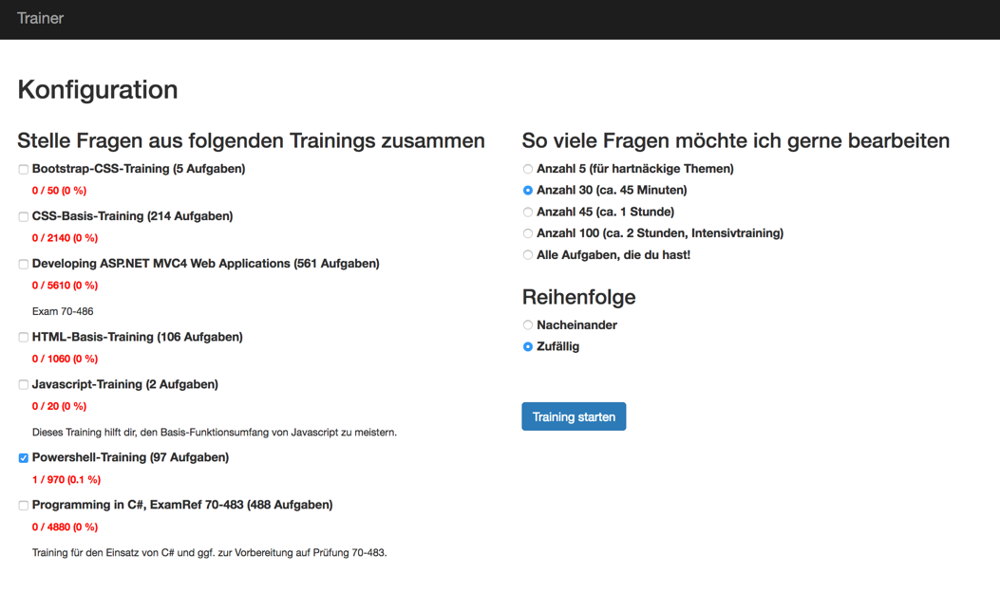

# Überblick 

Wenn du die Anwendung startest (z.B. durch Besuchen des GitHub-Pages Links), dann
präsentiert sich die Anwendung wie folgt:

Auf der linken Seite befindet sich eine Liste der geladenen Module.
Auf der rechten Seite sind einige Formauswahlen.

## Wie merkt sich der Trainer denn die Punktestände?

In deinem Webbrowser. Es gibt ein heißes Feature, dass heisst localStorage. 
Das ist mit HTML5 daher gekommen. Das tolle daran ist, dass wir so deine Punktestände im Webbrowser speichern können. 
Doof ist, dass du, wenn du die volle Historie deines Webbrowsers löscht, dass Du dann auch ggf. deine Punktestände löscht. 
Nunja. Und wenn du den Browser wechselst, dann ist dein Trainingsergebnis auch nicht da. 

## Ändern die Punktestände die Fragenfolge?

Aktuell ja. Der Fragealgorithmus ist natürlich eigentlich up to you. Ich hab zwar einen eingebaut, habe aber auch noch nie ein Optimum gefunden. Vermutlich muss man da auch eine Auswahl erstellen.

## Welche Fragetypen gibt es ?

Aktuell gibt es : 

  - Textaufgaben : Nunja, da steht dann ein Text. Entweder ist es Text zum vervollständigen oder Text muss so eingegeben werden. Die sind in einer Weise implementiert die bestimmte Toleranzen erlaubt. Damit sind sie in gewissen Rahmen für Quelltext-Eingaben geeignet. Sie kommen aber bei weitem nicht an die Engines von CodeSchool und Treehouse heran (vielleicht mal später :))

  - Würfeltextaufgaben : Das sind Textaufgaben. Dabei gibt man bei der Eingabe einem Generator einen Text. Der sucht sich dann verschiedene Worte aus dem Text und ersetzt diese durch Platzhalter. Der Übende muss versuchen, die richtigen Worte zu finden und einzusetzen. Als zusätzlicher Spass ändern sich von Trainingsrunde zu Trainingsrunde die verdeckten Worte. Hehehe.

  - Multiple Choice Aufgaben : Das sind die Klassiker. Die Engine wirft die Antworten übrigens bei jeder Abfrage durcheinander. Sie weiß, welche Antworten richtig sind und welche falsch. Durch dieses Mischen wird etwas besser verhindert, dass man nur reflexhaft lernt. Also nichts mit "hier ist die dritte Antwort richtig.".

  - Gegenfragen: Das sind algorithmische Umarbeitungen von Multiple Choice Aufgaben. Also man hat z.B. so eine typische Microsoft Frage mit Erklärungen und 5 Punkten und Punkt 3 ist falsch, und dazu gibts eine Texterklärung. Dann macht diese Umwandlung aus der Multiple Choice Aufgabe lauter Textaufgaben, in denen Sie die Erklärung in einen Lückentext umwandelt und in der Frage steht dann: "Warum ist bei der Frage ... die Antwort ... RICHTIG/FALSCH?" und dann muss man es halt wissen.. :)

  - Es gibt noch Wortsuchaufgaben. Aber im Moment habe ich keine Ahnung mehr, was das war :).

## Ich hab eine digitale Quelle, können wir die Fragen daraus irgendwie ableiten?

Das ist mein präferierter Weg. Manchmal gibt es ein Buch digital 
oder bei HTML gibt es ja Webseiten vom W3C oder so, die recht systematisch
verfasst sind. 

Diese sind hervorragende Grundlagen, um mit dem richtigen Scraper 
die entsprechenden Inhalte in ein Modul für diesen Trainer einzulesen. 

## Wie kann ich selbst Module schreiben?

Alle Module sind einfache Javascript-Dateien. Du kannst dir beispielhaft 
die bestehenden Module ansehen (Verzeichnis Source/js/module). Die sind von ihrer Natur her sehr unterschiedlich.

## Ich hab ein Fragensystem, d.h. kann ich Fragen dynamisch generieren?

Ja und nein. Generell kannst du Javascript verwenden, um Fragen zu generieren. Aber nur zum Anwendungsstart. Danach ist das ganze ein statisches Array. Die Anwendung muss ja auch irgendwoher die mögliche Gesamtzahl der Punkte berechnen, da wäre es doof, wenn sich die Anzahl der Fragen ständig ändert.

Damit kannst du dir alle möglichen Helfer in Javascript schreiben, die aus was auch immer was auch immer an Fragen erstellen.

## Gibt es noch mehr Module als die hier als Beispielmodule eingefügten?

Ja. Gibt es. Ich kann sie aber nicht öffentlich zugänglich machen. 
Es gibt welche speziell für den Arbeitgeber, bei dem ich gerade arbeite. *zwinker*
